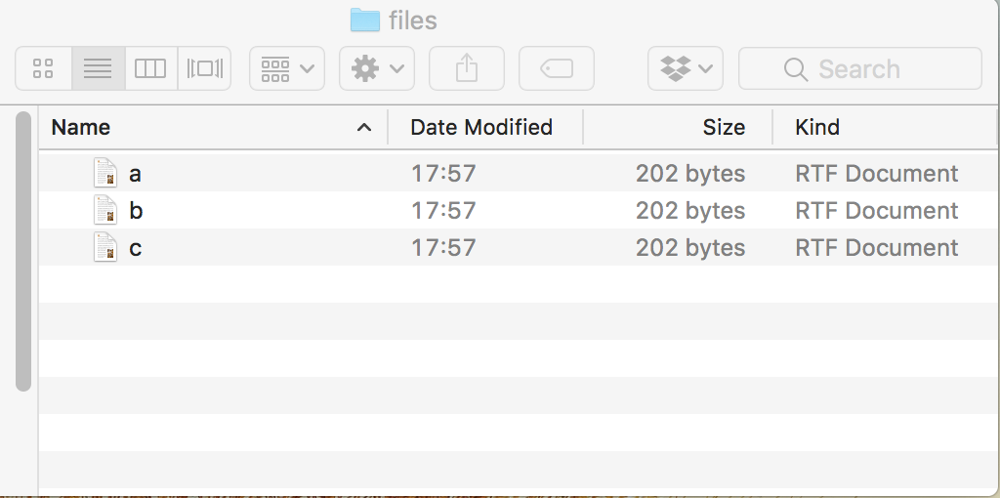
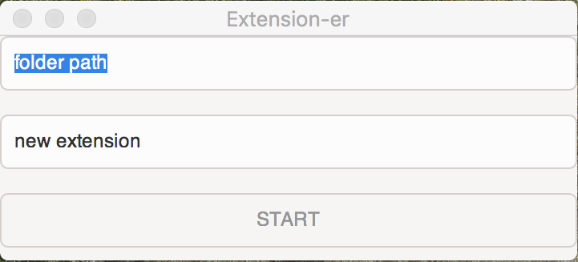
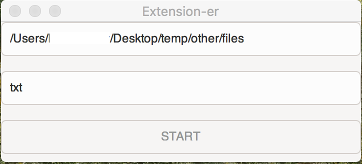
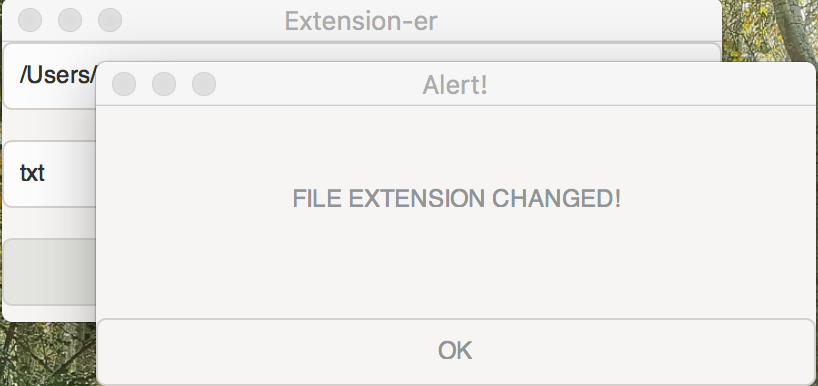
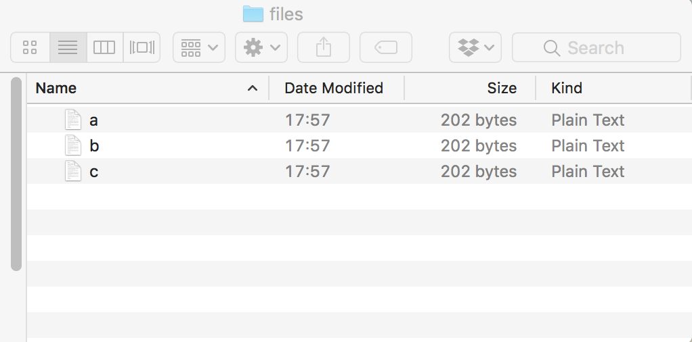

# Extension-er
Change extension of all files in a folder to any specified extension. It DOES NOT convert the files themselves. 

### Why should I use it?
If you need to change the extention of say 100 or 1000 files, then you can use the Extension-er app. It will do the job in under a second.

### How does it work?:
Suppose you have the following fiels in ../Desktop/temp
1. a.rtf
2. b.rtf
3. c.rtf
4. etc...

Using Extension-er you can change the extention of these files to txt (or any other) in a single click:
1. a.txt
2. b.txt
3. c.txt
4. etc...

### Download (mac os, windows 10, linux - soon)
If you would like to download a precompiled version, email me(rillk500@gmail.com), and I will send the download link to you.

### How to install it?
1. Install GTK+3 on your system (skip if installed)
2. Git clone this repository or download as .zip
3. Make sure you have DMD and DUB installed on your system
4. Open up your terminal/console and 'cd folder_name" to the folder
5. type 'dub' and press enter
6. It will build exe file with the same name and then execute it
7. To run it again, type 'dub' or './extension-er' and press enter

### How to use it?
1. Put all files in one folder.

2. Launch Extension-er

3. Enter the full path and new file extension

4. Click 'start'. A message will appear when done.

### The result (from the example above):

